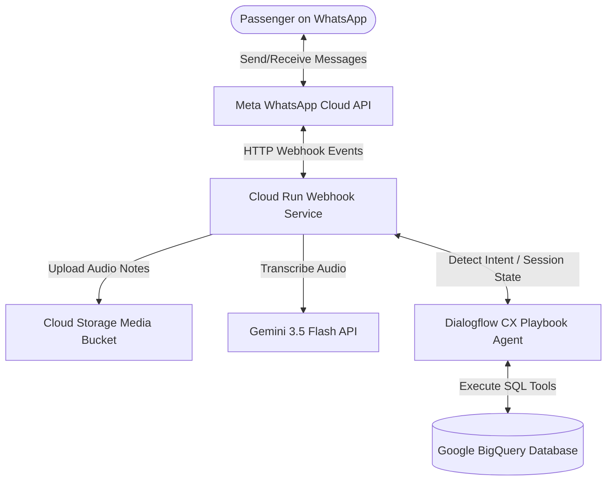

# WhatsApp Dialogflow CX Airline Agent Integration

This repository contains a complete, production-ready blueprint for integrating **Meta WhatsApp Cloud API** with **Google Cloud Dialogflow CX** and **Vertex AI (Gemini 3.5 Flash)** to build an automated, voice-enabled airline customer service agent.

The agent handles passenger queries like check-in, ticket booking, flight status updates, and authentication, backed by a Google Cloud BigQuery database and powered by Gemini for audio/voice note transcription.

---

## 🏗️ Architecture Overview

The system operates as a serverless event-driven architecture on Google Cloud:



1. **User Interaction**: The passenger sends a text message or a voice note on WhatsApp.
2. **Webhook Receiver**: A lightweight Flask webhook running on **Google Cloud Run** receives the Meta event securely.
3. **Voice Processing**: If the message is a voice note, the webhook downloads the audio stream, stores it temporarily in **Google Cloud Storage (GCS)**, and calls the **Gemini 3.5 Flash** model via the Google GenAI SDK to transcribe the audio into text.
4. **Dialogflow CX Resolution**: The text message (original or transcribed) is sent to **Dialogflow CX**. The agent processes the conversation flow, manages state, and triggers integrations.
5. **Database (BigQuery) Operations**: Dialogflow CX calls built-in BigQuery toolsets to verify passenger identity, query flight schedules, book flights, or complete a check-in status update.
6. **Response loop**: The agent's response is formatted and pushed back to the user's phone via the Meta WhatsApp Send Message API.

---

## 🌟 Key Features

* **Voice-to-Text Capabilities**: Built-in support for voice note inputs using Google's state-of-the-art **Gemini 3.5 Flash** model.
* **Unified State Management**: Managed via **Dialogflow CX** flows and playbooks.
* **Automated Data Lookup**: Real-time read/write interactions with Google BigQuery representing the airline reservation system.
* **Security & Isolation**: Clean decoupling of credentials using environment variables.
* **Single-Command Deployment**: Scripted deployment using Cloud Build and Google Cloud Run.

---

## 📁 Repository Structure

```
├── README.md                      # This documentation
├── airline-example-whatsapp/
│   ├── backend/
│   │   ├── main.py                # Backend server for database API endpoints
│   │   ├── setup_bq.py            # BigQuery table setup & seeding script
│   │   └── requirements.txt       # Backend dependencies
│   ├── webhook/
│   │   ├── main.py                # WhatsApp Webhook receiver & Gemini transcriber
│   │   ├── cx_client.py           # Dialogflow CX API interactions
│   │   ├── whatsapp_client.py     # Meta WhatsApp API helper
│   │   └── requirements.txt       # Webhook dependencies
│   ├── .env.template              # Environment configuration template
│   └── deploy.sh                  # Cloud Run deployment script
└── exported_app_airline-agent/
    └── airline-agent/             # Exported Dialogflow CX agent files
```

---

## ⚙️ Prerequisites & Setup

### 1. Google Cloud Configuration
Ensure you have a Google Cloud Project with the following APIs enabled:
* Cloud Run API
* Cloud Build API
* Vertex AI API (and GenAI services)
* BigQuery API
* Cloud Storage API

Make sure your deployment credentials or Service Account has roles:
* `Storage Admin`
* `BigQuery Admin`
* `Run Developer`
* `Cloud Build Editor`

### 2. Meta WhatsApp Developer Setup
1. Create a developer account on the **[Meta App Dashboard](https://developers.facebook.com/)**.
2. Create a Business App and add the **WhatsApp** product.
3. Obtain your:
   * **Temporary/Permanent WhatsApp System Access Token**
   * **WhatsApp Phone Number ID**
   * A verification string (Verify Token) of your choice for the webhook hookup.

---

## 🚀 Setup Walkthrough

### Step 1: Prepare Environment Variables
Copy `.env.template` to a new file named `.env` in the `airline-example-whatsapp` directory:
```bash
cp airline-example-whatsapp/.env.template airline-example-whatsapp/.env
```
Fill out the keys in `.env`:
* `WHATSAPP_TOKEN`: Your Meta WhatsApp Access Token.
* `WHATSAPP_PHONE_NUMBER_ID`: The ID of your registered WhatsApp business phone number.
* `WHATSAPP_VERIFY_TOKEN`: A custom string of your choice (e.g., `secure_webhook_verify_2026`).
* `GCS_BUCKET_NAME`: The name of the GCS bucket where voice notes should be saved for transcription.
* `GOOGLE_CLOUD_PROJECT`: Your Google Cloud Project ID.
* `GOOGLE_CLOUD_REGION`: The region for your deployment (e.g., `us-central1`).

---

### Step 2: Initialize the BigQuery Database
Install backend dependencies and run the BigQuery seeder script to create the reservation tables and seed dummy flights and tickets:
```bash
cd airline-example-whatsapp/backend
pip install -r requirements.txt
export GOOGLE_CLOUD_PROJECT="your-project-id"
python setup_bq.py
```
This script creates a BigQuery dataset named `airline_example_demo` and a `reservations` table containing passenger details, confirmation numbers, member numbers, and flight details.

---

### Step 3: Import the Dialogflow CX Agent
1. Open the **[Dialogflow CX Console](https://dialogflow.cloud.google.com/cx/)**.
2. Select your Google Cloud Project.
3. Click **Create Agent** or select **Import Agent** if you are importing into an existing configuration.
4. Choose **Upload** and select the ZIP file found in the exported agent directory (`exported_app_airline-agent/airline-agent`).
5. Set up a dedicated Service Account in Dialogflow CX and configure access to BigQuery. Reference the `exported_app_airline-agent/airline-agent/environment.json` file for the expected format.

---

### Step 4: Deploy the Webhook to Cloud Run
To compile your container and deploy the WhatsApp integration to Google Cloud Run, execute the deployment script:
```bash
cd airline-example-whatsapp
chmod +x deploy.sh
./deploy.sh
```
Once deployed, the script outputs a **Cloud Run Webhook URL**.

---

### Step 5: Configure the Webhook in Meta Developer Console
1. Head back to the **Meta Developer Console** under your app's **WhatsApp > Configuration**.
2. Click **Edit** next to Webhook configuration.
3. In **Callback URL**, paste the URL generated by the `deploy.sh` script.
4. In **Verify Token**, input the value you set for `WHATSAPP_VERIFY_TOKEN` in your `.env` file.
5. Click **Verify and Save**.
6. Under **Webhook Fields**, subscribe to `messages` to start receiving WhatsApp conversation events.

---

## 🧪 Testing the Integration
Once everything is configured:
1. Send a text message like `"Hi"` or `"I want to check in"` to your WhatsApp Business phone number.
2. Try sending a voice note (audio message) asking `"What is my flight status?"` or `"I want to authenticate myself"`.
3. Check the Cloud Run service logs to monitor the voice-to-text transcription process and Dialogflow CX responses.
